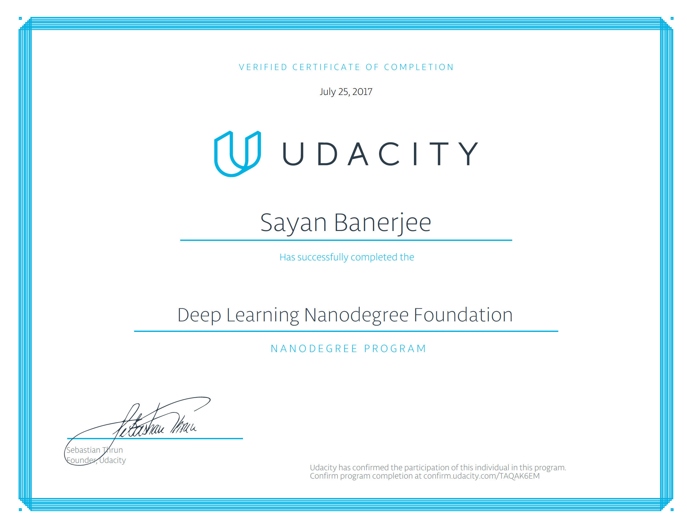

# Deep Learning Nanodegree

This repository contains project works, coding files and materials related to Udacity's <b>Deep Learning Nanodegree</b> program from 2017. It consists of a bunch of exercise and tutorial notebooks for various deep learning topics. In most cases, the notebooks lead you through implementing models such as convolutional networks, recurrent networks, and GANs. There are other topics covered such as weight initialization and batch normalization.

There are also notebooks used as projects for the Nanodegree program. In the program itself, the projects are reviewed by Udacity experts, but they are available here as well.

### This repository is TensorFlow 1.X dependent. 

##Certificate:
[Udacity Deep Learning Certificate][https://confirm.udacity.com/TAQAK6EM]

[https://confirm.udacity.com/TAQAK6EM]: https://confirm.udacity.com/TAQAK6EM

